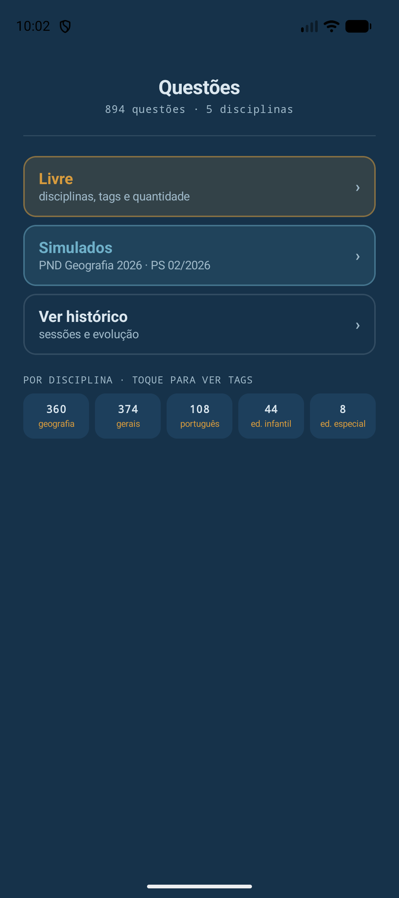
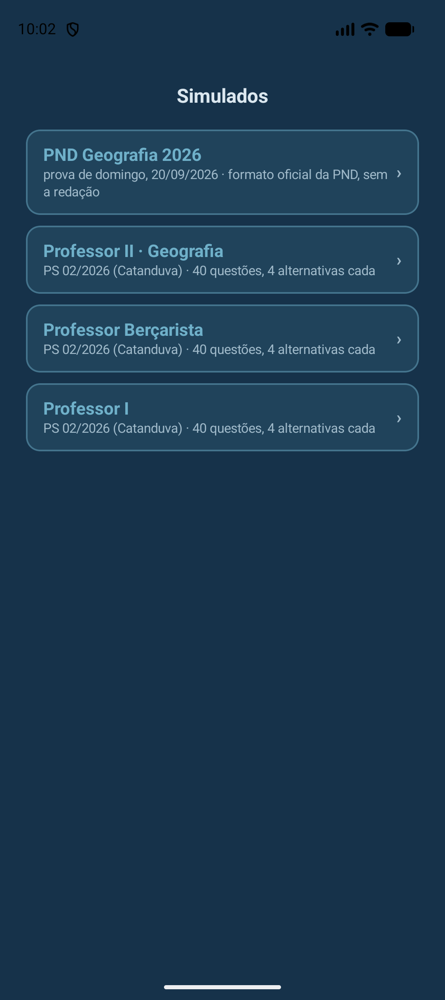
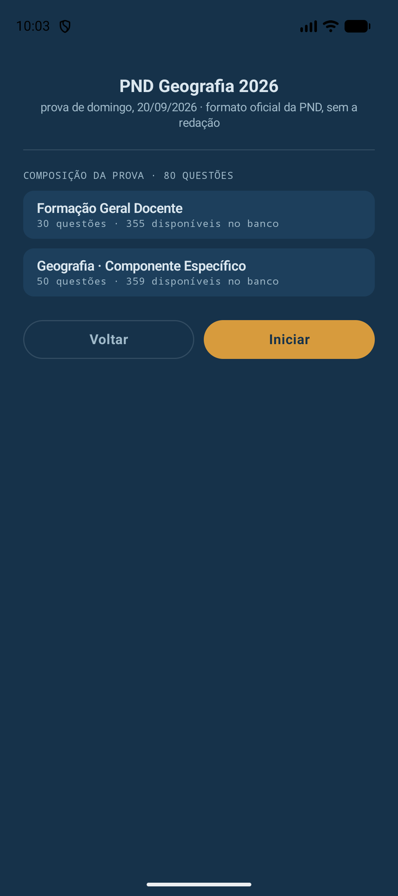
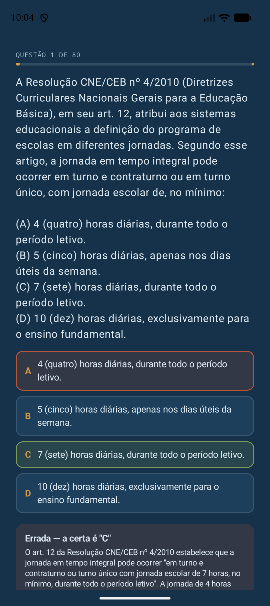
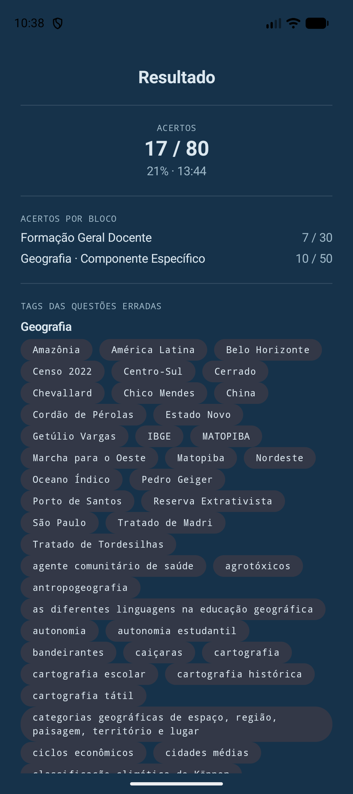

# Questões

Aplicativo Android de autoavaliação para concursos públicos e processos seletivos na área de Geografia e educação, com um banco de 894 questões organizadas por disciplina, tags de assunto e concurso de origem.

O projeto nasceu de uma necessidade pessoal de estudo para concursos (PSS SEDUC-SP, processos seletivos municipais, ENADE de Licenciatura em Geografia, PND — Prova Nacional Docente) e evoluiu para um banco de questões estruturado, com o objetivo de treinar por disciplina, por tema específico ou simulando a prova real de um cargo ou exame.

## Status

MVP funcional: as sete telas do fluxo (Home, Seleção · Livre, Quiz, Resultado, Histórico, Seleção de simulado) estão implementadas e testadas em emulador — ver [Roadmap](#roadmap) pro que ainda falta (atualização remota do banco, testes automatizados, imagens reais, fontes do Google Fonts).

## Funcionalidades

- **Modo Livre**: escolha uma ou mais disciplinas, filtre por tags de assunto e defina a quantidade de questões; ordem aleatória (disciplinas misturadas) ou sequencial (uma disciplina inteira por vez).
- **Simulados**: prova completa no formato oficial de um cargo/exame específico, com blocos por peso/área sorteados a partir do banco. Hoje tem 4 disponíveis:
  - **PND Geografia 2026** — Prova Nacional Docente (MEC/INEP), 30 questões de Formação Geral Docente + 50 de Geografia (Componente Específico), sem a redação. O pool de cada bloco é filtrado pelas tags dos objetos de conhecimento oficiais da matriz (Portarias Inep nº 315/2025 e nº 323/2025).
  - **Professor II · Geografia**, **Professor Berçarista** e **Professor I** — Processo Seletivo 02/2026 da Prefeitura de Catanduva/SP, 40 questões cada (10 Língua Portuguesa + 15 Conhecimentos Pedagógicos e Legislação + 15 Conhecimentos Específicos), 4 alternativas por questão, como no edital real.
- **Correção com feedback**: explicação de cada questão logo após a resposta, com cronômetro por questão e por sessão.
- **Histórico local**: todas as sessões (Livre e Simulado) ficam salvas no aparelho; reabrir uma sessão do Histórico mostra o mesmo Resumo de quando ela terminou, incluindo os acertos por bloco nos simulados.

## Como usar o app

- **Livre**: na Home, toque em "Livre", marque uma ou mais disciplinas (um pop-up pede as tags e a quantidade de questões de cada uma) e escolha a ordem antes de iniciar.
- **Simulados**: toque em "Simulados" pra ver a lista das provas disponíveis. Cada card mostra a composição (quantos blocos, quantas questões e quantas estão disponíveis no banco) antes de você confirmar o início.
- **Histórico**: toque em "Ver histórico" pra listar todas as sessões já feitas e reabrir o resumo de qualquer uma delas.
- **Atualizar o banco de questões**: ainda não existe um mecanismo de sincronização remota (ver [Roadmap](#roadmap)) — por enquanto, uma versão mais nova do banco só chega instalando uma versão mais nova do app (ver [Instalação](#instalação)). A importação do banco pros dados locais do app acontece uma única vez, na primeira abertura após instalar/reinstalar.

## Capturas de tela

| Home | Simulados | Composição do simulado |
|---|---|---|
|  |  |  |

| Quiz (feedback) | Resultado (acertos por bloco) |
|---|---|
|  |  |

## Instalação

Não publicado na Play Store. Pra instalar sem compilar:

1. Baixe o APK mais recente na aba [Releases](../../releases) deste repositório.
2. No aparelho, habilite a instalação de apps de fontes desconhecidas pro navegador/gerenciador de arquivos usado (Android pede isso a cada app não vindo de uma loja).
3. Abra o APK baixado e instale.

É um build de debug (sem assinatura de release/Play Store) — o Android avisa disso na instalação, o que é esperado pra um projeto pessoal ainda em desenvolvimento.

## Stack técnica

| Camada | Tecnologia |
|---|---|
| Linguagem | Kotlin |
| UI | Jetpack Compose |
| Navegação | Navigation Compose (rotas type-safe) |
| Persistência local | Room (SQLite) |
| Build | Android Gradle Plugin 9, Kotlin embutido do AGP (sem plugin Kotlin clássico) |
| Serialização | kotlinx.serialization |
| Anotações/codegen | KSP |
| Imagens remotas | Coil (carregamento sob demanda) |

`minSdk` 24 (Android 7.0), `compileSdk`/`targetSdk` 37.

## Arquitetura

O app segue uma separação simples por responsabilidade, em módulo único, sem framework de DI (Hilt/Koin) nem ViewModel por ora — decisão deliberadamente mínima enquanto o projeto é pequeno:

```
net.oraphael.questoes
├── data
│   ├── db          → entidades Room, DAO e AppDatabase
│   ├── importer     → converte o JSON do banco de questões em linhas do Room
│   └── repo         → fachadas de leitura/escrita usadas pela UI (QuestaoRepository, SessaoRepository)
├── domain           → MotorSessao (sorteio de questões do modo Livre e dos Simulados)
├── ui
│   ├── navigation    → NavHost e rotas type-safe
│   ├── screens        → uma pasta por tela (home, selecaolivre, quiz, resultado, historico, selecaosimulado)
│   └── theme          → cores, tipografia e tema Compose ("Carta anotada")
├── MainActivity.kt
└── QuestoesApplication.kt
```

**Modelo de dados.** As questões são distribuídas como arquivos `.json` por disciplina (em `app/src/main/assets/questoes/`) e importadas para um banco Room local na primeira execução do app. Esse banco é a única fonte consultada em tempo de execução — os `.json` nunca são lidos diretamente pela UI. O importador normaliza uma inconsistência histórica do banco de questões, em que o campo `alternativas` aparece ora como dicionário (`{"A": "texto", ...}`), ora como lista de objetos (`[{"letra": "A", "texto": "..."}]`), unificando os dois formatos numa única tabela relacional (`Alternativa`).

**Imagens.** Questões que dependem de imagem não a incluem no `.json` — só uma lista de descrições textuais (`imagens_desc`, 0 ou mais por questão). A URL de cada imagem é montada em tempo de execução a partir do id da questão e do índice dela, e resolvida contra um repositório dedicado no GitHub ([`questoes-banco`](https://github.com/Raphael-GC/questoes-banco)), servido via `raw.githubusercontent.com` e carregado sob demanda — sem empacotar imagens dentro do `.apk`. Enquanto uma imagem específica ainda não existe naquele repositório, a tela cai de volta pra descrição textual.

**Atualização remota do banco.** Ainda não implementada (ver [Roadmap](#roadmap)) — a mecânica exata (frequência, formato do pacote, adicionar vs. substituir vs. remover questão) é uma decisão de produto em aberto.

## Banco de questões

| Disciplina | Questões |
|---|---|
| Geografia | 360 |
| Gerais / Didático-pedagógico | 374 |
| Português | 108 |
| Educação Infantil | 44 |
| Educação Especial | 8 |
| **Total** | **894** |

As questões vêm de provas oficiais reais (PSS SEDUC-SP, ENADE Licenciaturas Geografia/INEP-Sinaes, PS 02/2026 de Catanduva/SP, e diversos outros processos seletivos municipais) e de um conjunto de questões autorais escritas com base nos editais e matrizes de referência oficiais (como as da PND 2026), pra cobrir cargos, exames e conteúdos ainda sem prova pública disponível ou com pouca cobertura. Cada questão é autocontida (enunciado completo, sem depender de contexto externo) e traz alternativas, resposta correta, explicação, tags de assunto e a referência do concurso/exame de origem.

O código-fonte do banco de questões (os arquivos `.json`) vive em um repositório próprio, separado deste; este repositório contém apenas o aplicativo.

## Como rodar o projeto

1. Clone o repositório e abra a pasta no Android Studio.
2. Deixe o Gradle sincronizar (o projeto usa o catálogo de versões em `gradle/libs.versions.toml` — nenhuma configuração manual é necessária).
3. Rode o app em um emulador ou dispositivo com Android 7.0 ou superior.
4. Na primeira execução, o app importa as 894 questões dos arquivos em `assets/questoes/` para o banco Room local — isso acontece uma única vez, em segundo plano. Se você já tinha uma versão antiga instalada, limpe os dados do app (ou desinstale/reinstale) pra forçar a reimportação com o banco atualizado.

## Roadmap

- [x] Banco de questões consolidado e validado (894 questões, 5 disciplinas)
- [x] UX definida (mapa de navegação, fluxos de Livre/Simulado/Histórico)
- [x] Direção visual e catálogo de componentes
- [x] Arquitetura técnica definida e documentada
- [x] Camada de dados: schema Room, importador de JSON, importação automática no primeiro boot
- [x] Telas do MVP em Compose (Home, Seleção · Livre, Quiz, Resultado, Histórico, Seleção de simulado)
- [x] Simulados: PND Geografia 2026 e os 3 cargos do PS 02/2026 de Catanduva
- [ ] Atualização remota do banco de questões (tela "Atualizar banco" ainda é placeholder)
- [ ] Pós-MVP: revisão por tag, gráfico de evolução, exportação/backup do histórico
- [ ] Testes automatizados
- [ ] Fontes reais do Google Fonts (hoje usa fontes do sistema como placeholder)
- [ ] Imagens reais das questões que dependem de imagem

## Licença

Distribuído sob a [GNU General Public License v3.0](LICENSE).

## Autor

Raphael Guedes Carneiro — [github.com/Raphael-GC](https://github.com/Raphael-GC)
